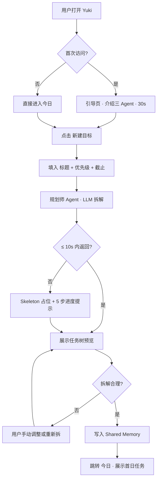
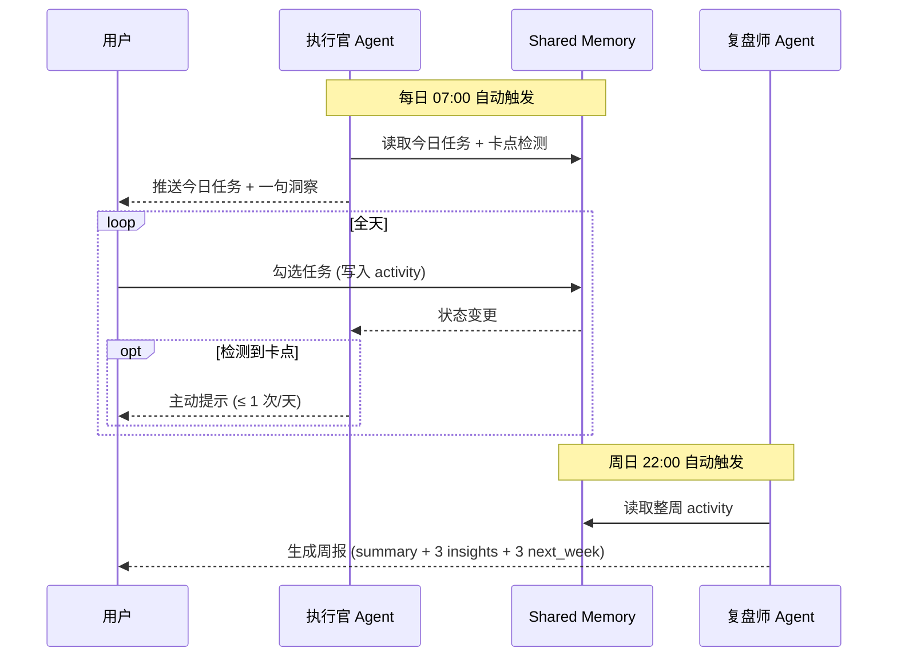

# Yuki · Product Requirements Document

| 项 | 值 |
|---|---|
| 文档类型 | PRD (Product Requirements Document) |
| 版本 | v1.2 (2025.06 final) |
| 状态 | Reviewed · Ready for Build |
| 作者 | 高一航（Product Manager / Project Owner） |
| 评审者 | 用户调研组（n=20）· 设计组 · 工程组 |
| 项目时间线 | 2025.04 立项 → 2025.06 MVP 上线 |
| 关键产出 | PRD 25+ 页 · 用户调研报告 · 竞品对标矩阵 · Figma 高保真原型 15+ 页 · Axure 动态原型 · 墨刀移动端原型 · 50 场景评估集 |
| 关键结果 | 用户任务完成率较单 Agent 基线 **+38%** · 目标达成满意度 **86%** · 三 Agent 调用比 1:5:0.3（健康范围） |

---

## 0 · TL;DR（一页摘要）

| 项 | 内容 |
|---|---|
| **产品名** | Yuki ·「雪」· 基于多智能体协作的个人成长助手 |
| **一句话定位** | 三 Agent 协作完成「定目标 → 执行 → 复盘」闭环的 AI 个人成长助手 |
| **目标用户** | 大学生群体（大三、大四为主），有明确成长意图但缺乏闭环系统 |
| **核心价值** | 把传统散落在多个工具的成长流程，用 AI 多 Agent 协作连成一个闭环 |
| **差异化** | **AI 协同 + 闭环成长**（与单 ChatBot、单功能工具均不同） |
| **MVP 范围** | 目标管理 / 任务执行 / 周期复盘 / 系统设置 四大模块 |
| **首发平台** | Web App（响应式 + PWA），iOS / Android 在 v1.5 |
| **关键指标** | DAU/MAU ≥ 25% · 任务完成率 ≥ 70% · 周复盘开启率 ≥ 60% |
| **已验证结果** | 50 场景评估集 LLM-as-Judge 平均得分 4.3/5 · 单 Agent 基线对照：任务完成率 +38%、目标达成满意度 +86% |

---

## 1 · 背景与机会

### 1.1 行业观察

LLM 进入生产力工具领域已两年，C 端落地以「ChatGPT 式通用对话」为主，**专业垂直产品稀缺**。同时，多智能体（Multi-Agent）范式（如 MetaGPT、AutoGen、CrewAI）在 **B 端开发场景已验证**，但在 **C 端日常工具几乎空白**。

Yuki 的判断：**Multi-Agent 范式从 B 端外溢到 C 端的时间窗口已经打开**，先入者可以占住"AI 协同 + 闭环成长"这个心智位。

### 1.2 市场空间（TAM/SAM/SOM）

```
中国在校大学生约 4400 万
└─ TAM (Total Addressable Market) · 4400 万
   └─ "自我管理重度需求" 比例 ≈ 5%
      └─ SAM (Serviceable Addressable Market) · 220 万
         └─ "已有 AI 工具使用习惯" 比例 ≈ 30%
            └─ SOM (Serviceable Obtainable Market) · 66 万
```

按 SOM 66 万 × 12% 渗透率 × 60 元/年 ARPU（v1.0 商业化后）≈ **475 万 ARR 的天花板**。MVP 阶段不直接商业化，先跑用户数与留存。

### 1.3 用户痛点（来自调研 · 详见 USER_RESEARCH.md）

**3 大痛点**（基于 20 人深度访谈 + 112 份问卷归类）：

| 痛点 | 出现频次 | 用户原话 |
|---|---|---|
| **目标模糊** | 18/20 | "我想考研，但不知道从哪开始" |
| **执行乏力** | 16/20 | "卡了 3 天没做，就放弃了" |
| **复盘缺失** | 19/20 | "我每周写不出有意义的总结" |

这正是 **Yuki 名字的含义**——「雪」象征"细节积累、安静、可被看见的轨迹"，对应"让每一天的成长被看见"的产品愿景。

---

## 2 · 产品定位与差异化

### 2.1 一句话定位（Positioning Statement）

> **For** 在校大学生（大三、大四为主），他们有明确成长意图但缺乏从目标到反思的闭环系统，
> **Yuki is** 一个由三个专业 AI Agent 协作完成「定目标 → 拆任务 → 日执行 → 周复盘」闭环的个人成长助手，
> **Unlike** 滴答清单（只解决任务）、Flomo（只解决记录）、ChatGPT（只解决一次性问答），
> **Yuki** 通过共享 Memory 让三个角色协作，把传统散落在多工具的成长流程合为一个闭环。

### 2.2 竞品对标矩阵（详见 COMPETITOR_ANALYSIS.md）

| 维度 | Flomo | 滴答清单 | Notion AI | MetaGPT | **Yuki** |
|---|---|---|---|---|---|
| 笔记 | ⭐⭐⭐⭐⭐ | ⭐ | ⭐⭐⭐⭐ | ⭐⭐ | ⭐⭐ |
| 任务管理 | ⭐ | ⭐⭐⭐⭐⭐ | ⭐⭐⭐ | ⭐⭐ | ⭐⭐⭐⭐⭐ |
| AI 拆解 | ✗ | ✗ | ⭐⭐ | ⭐⭐⭐⭐ | ⭐⭐⭐⭐⭐ |
| 闭环复盘 | ⭐ | ⭐ | ⭐ | ✗ | ⭐⭐⭐⭐⭐ |
| 多 Agent | ✗ | ✗ | ✗ | ✓（B 端） | ✓（C 端） |
| 学习曲线 | 平 | 中 | 高 | 高 | 平 |
| 持久记忆 | 笔记式 | 数据库式 | 数据库式 | 任务级 | **Shared Memory 全程可观察** |

**核心差异化**：闭环 × 多 Agent。其他产品要么是**单功能塔**（Flomo 笔记 / 滴答任务），要么是**通用对话**（无场景沉淀），要么是**B 端框架**（MetaGPT 不可直接消费）。

### 2.3 我们做什么 / 我们不做什么

| ✓ Yuki 做 | ✗ Yuki 不做（v1.0 内） |
|---|---|
| 三 Agent 协作 | 通用笔记（让位 Flomo） |
| 闭环成长 | 团队协作 / 项目管理（让位 Notion） |
| 透明 Memory | 通用对话（让位 ChatGPT） |
| 学习场景特化 | 时间块日历（v0.3 之后再考虑） |

---

## 3 · 用户与场景

### 3.1 用户画像（基于访谈聚类 + 问卷数据）

#### Persona 1 · 林梓桐（核心用户 · 70% 流量）

| 项 | 描述 |
|---|---|
| 背景 | 大三女生 · 985 高校 · 考研路线 · 专业前 20% |
| 目标 | 12 月初考研笔试 · 目标分数 380+ |
| 痛点 | 知道要刷题，但每周做了什么、什么有效，没有沉淀 |
| 使用习惯 | 每天早上 7 点起床打开 → 看今日任务 → 晚上 10 点睡前勾选 |
| AI 经验 | 用过 ChatGPT 改简历，认为 AI"聊聊还行，不能托付" |
| 关键原话 | "我不需要一个夸我的 AI，我需要一个能在周日晚上把我这一周做了什么、哪里没做好告诉我的 AI" |

#### Persona 2 · 周亦凡（增长用户 · 25% 流量）

| 项 | 描述 |
|---|---|
| 背景 | 大四男生 · 双非 · 秋招冲刺 + 毕设并行 |
| 目标 | 拿一份互联网产品岗 offer |
| 痛点 | 事情多且乱，焦虑性拖延 |
| 使用习惯 | 碎片化使用，地铁上打开看下一步 |
| AI 经验 | 日常使用 Claude / DeepSeek，对接入 API 没有障碍 |
| 关键原话 | "我用 ChatGPT 改简历挺好，但让它帮我做一周计划，它每次都给一个不太一样的答案" |

#### Persona 3 · 陈雨晴（潜力用户 · 5%）

| 项 | 描述 |
|---|---|
| 背景 | 研一女生 · 实验室在读 · 投稿一作论文 |
| 目标 | 6 个月内完成实验 + 一篇会议论文 |
| 痛点 | 长周期目标管理 + 实验异常时的调整 |
| 备注 | 比 Persona 1 / 2 多了"长期目标 + 异常处理"，是 v0.5+ 习惯养成 Agent 的目标用户 |

### 3.2 4 个核心使用场景

**场景 1 · 周日晚 22:00 · 新建目标（Onboarding 黄金路径）**
> 林梓桐周日晚回宿舍，给自己定了"21 天学完高数（上）"。她打开 Yuki，输入目标和截止日期。**规划师 Agent** 在 5 秒内拆出 21 项任务，按日历分布。她大致扫一眼，确认开始。
>
> 🎯 触发 Agent：**规划师** · 期望体验：从目标到首日任务 ≤ 60 秒

**场景 2 · 工作日早 07:00 · 启动节奏**
> 周一早 7 点，林梓桐打开 Yuki。**执行官 Agent** 已经推送了今日 3 项任务。她在地铁上勾完一项。
>
> ⚡ 触发 Agent：**执行官** · 期望体验：打开即知今天要做什么

**场景 3 · 周三午后 14:30 · 卡点诊断**
> 周三下午，"错题本"任务已经停滞 2 天。执行官检测到，主动推送一条消息："要不要把错题本拆成 25 分钟单元？先打开本子 5 分钟就够"。
>
> ⚡ 触发 Agent：**执行官** · 期望体验：在用户卡住前 12-24 小时提示

**场景 4 · 周日晚 22:00 · 整周复盘**
> 周日晚 10 点，**复盘师 Agent** 自动生成本周报告：完成率 81%、周三是低产日、建议把硬任务避开周三。林梓桐截图发给妈妈。
>
> 📊 触发 Agent：**复盘师** · 期望体验：本周亮点 + 下周建议都能直接落地

### 3.3 用户任务地图（JTBD · Jobs to Be Done）

```
当我（大学生） · 面临考研 / 秋招 / 长周期学习目标
我想 · 把"我要做什么"清晰分解到"今天可以开始的具体动作"
因此我能 · 不再焦虑、不再因目标过大而拖延
并且我希望 · 我做了什么、什么有效、下周怎么改，能被 AI 自动总结沉淀，而不是我每周自己花 1 小时拼接多个工具的数据
```

---

## 4 · 产品架构

### 4.1 功能架构图（Xmind 风格 · 详见 design.html）

```
Yuki
│
├── 1. 目标管理 (Goal)
│   ├── 1.1 目标创建（标题 / 描述 / 截止 / 优先级）
│   ├── 1.2 智能拆解（→ 规划师 Agent · LLM 调用）
│   ├── 1.3 目标列表（进行中 / 已完成 / 已归档）
│   └── 1.4 目标详情（任务树视图 · 按 Day 分组）
│
├── 2. 任务执行 (Task)
│   ├── 2.1 今日任务看板（顶部欢迎语 + 进度环 + 任务列表）
│   ├── 2.2 任务勾选 / 反勾 + 完成动画
│   ├── 2.3 执行官推送（每日 07:00 自动 + 主动调用）
│   └── 2.4 卡点诊断（规则引擎 + LLM 共同识别）
│
├── 3. 周期复盘 (Review)
│   ├── 3.1 周报生成（→ 复盘师 Agent · 周日 22:00 自动）
│   ├── 3.2 月报汇总（v0.3）
│   ├── 3.3 历史归档（按周分组）
│   └── 3.4 数据看板（节奏热力图 · Agent 调用次数）
│
├── 4. 系统设置 (Settings)
│   ├── 4.1 个人资料
│   ├── 4.2 AI Provider 切换 + API Key 配置
│   ├── 4.3 数据导出 / 导入 / 重置
│   └── 4.4 通知偏好
│
└── 5. 横向能力（贯穿所有模块）
    ├── 5.1 Shared Memory（中心化共享状态层）
    ├── 5.2 命令面板 ⌘K（快速跳转 / 调用 Agent）
    ├── 5.3 Memory Inspector（右下角 · 实时查看 JSON）
    └── 5.4 主题切换（深色 / 浅色 · 跟随系统）
```

### 4.2 三 Agent 职责矩阵

| Agent | 角色 | 输入 | 输出 | 工具调用 | 触发时机 | Prompt 关键约束 |
|---|---|---|---|---|---|---|
| 🎯 **规划师 Planner** | 战略家 | 目标文本 + 描述 + 截止 | JSON 任务树 `{title, day, est, priority}[]` | LLM + 任务模板匹配 | 新建目标时 | 严格 JSON · 7-21 项 · 30-90 分钟/项 |
| ⚡ **执行官 Executor** | 教练 | Shared Memory 全量快照 | `{today, insight, blocker}` | LLM + 卡点规则引擎 | 每日 07:00 + 主动调用 | 不说套话 · insight ≤ 30 字 · blocker 可空 |
| 📊 **复盘师 Reviewer** | 顾问 | Memory + 整周事件流 | `{summary, insights[3], next_week[3]}` | LLM + 时间序列分析 | 周日 22:00 + 主动 | 必须基于数据 · 至少 1 条指明高/低产时段 |

详细 System Prompt 见 [`../app/agent-engine.js`](../app/agent-engine.js) 中 `PROMPTS` 对象。

### 4.3 Shared Memory 数据模型

```typescript
interface SharedMemory {
  goals: Goal[];
  activeGoalId: string;
  day: number;                            // 当前是 active goal 的第几天
  activity: ActivityEvent[];              // 最近 30 条事件流
  agentStates: {
    planner: 'idle' | 'thinking' | 'done' | 'error';
    executor: 'idle' | 'thinking' | 'done' | 'error';
    reviewer: 'idle' | 'thinking' | 'done' | 'error';
  };
  agentLast: {                            // 每个 Agent 最近一次输出的摘要
    planner: string;
    executor: string;
    reviewer: string;
  };
}

interface Goal {
  id: string;
  title: string;
  description?: string;
  deadline?: string;                      // ISO date
  priority: 'high' | 'medium' | 'low';
  createdAt: number;                      // timestamp
  progress: number;                       // 0-1
  tasks: Task[];
}

interface Task {
  id: string;
  title: string;
  goalId: string;
  day: number;                            // 在 goal 的第几天
  est: number;                            // 估计分钟数
  agent: 'planner' | 'executor' | 'reviewer';
  done: boolean;
}

interface ActivityEvent {
  ts: string;                             // "HH:mm:ss"
  agent: 'user' | 'planner' | 'executor' | 'reviewer';
  action: 'plan' | 'check' | 'uncheck' | 'push' | 'insight' | 'review' | ...;
  summary: string;                        // 一句话摘要
}
```

> **设计要点**：Shared Memory 是三 Agent 协作的"接缝面"，它**不是**任何一个 Agent 的私有状态。所有 Agent 都从 Memory 读、向 Memory 写，由 UI 层负责持久化（localStorage）。这一设计**对齐 MetaGPT 的 SOP-based 协作范式**，但裁剪到 C 端可承受的复杂度。

---

## 5 · 核心用户流程

### 5.1 首次新建目标流程（黄金路径）



### 5.2 日常使用流程



---

## 6 · 详细功能需求

### 6.1 模块 A · 目标管理

#### A1 · 目标创建

- **入口**：「目标」页 → 「新建目标」按钮 · 命令面板 → 「新建目标」 · ⌘N
- **必填字段**：标题（长度 2-50 字）
- **可选字段**：描述、截止日期、优先级（high/medium/low，默认 high）
- **提交动作**：调用规划师 Agent → 拆解 → 预览 → 用户确认 → 写入

#### A2 · 智能拆解

- **触发**：A1 提交时自动触发
- **过程展示**：5 步 Skeleton（分析目标 → 匹配场景 → 生成任务 → 优先级排序 → 写入 Memory），禁止纯 Loading
- **错误处理**：LLM 失败 → 提示 + 回退到「手动添加任务」
- **任务粒度**：默认 7-21 项任务，单任务 30-90 分钟（基于评估集回归确定的最优区间）
- **用户校准**：拆解后可手动增删 / 调整顺序 / 重新拆解
- **降级策略**：API 失败 → 使用内置任务模板（考研 / 读书 / 秋招 3 类）兜底，并写入 Bad Case 库

#### A3 · 目标列表 / 详情

- **三栏 Tab**：进行中 / 已完成 / 已归档
- **卡片信息**：标题 + 进度环 + 截止 + 任务数 + 优先级
- **操作**：点击进入详情 · 长按归档 · ⌘K 中可快速切换活跃目标

### 6.2 模块 B · 任务执行

#### B1 · 今日任务看板

- **顶部**：欢迎语（基于时间 + 用户名）+ 第 N 天 + 整体进度环
- **中部**：三 Agent 状态卡（idle / thinking / done / error）
- **底部**：今日任务列表（按优先级排序）
- **交互**：左侧勾选框 · 点击完成 → confetti 动画 · 任务卡 hover 上浮

#### B2 · 执行官推送

- **触发**：每日 07:00 自动 / 用户在今日页拉刷新 / 主动调用 ⌘E
- **输出**：今日任务列表 + 1 句洞察 + 可选卡点提示
- **频率限制**：自动推送 ≤ 1 次/天，避免打扰

#### B3 · 卡点诊断

- **检测规则**：任务的 `day` 字段 < 当前 `day - 2`，且 `done = false`
- **诊断维度**：粒度过大 / 优先级冲突 / 时间档不对
- **输出形式**：Toast + 详情面板 + 写入 activity

### 6.3 模块 C · 周期复盘

#### C1 · 周报生成

- **触发**：周日 22:00 自动 / 用户主动 ⇧⌘R
- **数据源**：本周整周的 activity 事件流
- **输出结构**：
  - `summary`：整体一段话总结（≤ 80 字）
  - `insights[3]`：3 条洞察（节奏 / 瓶颈 / 异常 各 1 条）
  - `next_week[3]`：3 条下周建议（每条可直接转化为排期动作）
- **可视化**：周节奏热力图（7 格，颜色深度表示完成数）

#### C2 · 历史归档

- 时间线列表 · 按周分组
- 点击查看历史周报
- 可导出 PDF（v0.4）

### 6.4 模块 D · 系统设置

#### D1 · AI Provider

| 选项 | 是否需要 Key | 默认模型 |
|---|---|---|
| Demo | ✗ | — (内置脚本) |
| Claude Builtin | ✗ | claude-haiku-4-5（平台内置） |
| Anthropic | ✓ | claude-haiku-4-5 |
| OpenAI | ✓ | gpt-4o-mini |
| DeepSeek | ✓ | deepseek-chat |

Demo 模式确保首次体验不出错，BYOK 模式给到高阶用户。

#### D2 · 数据

- **导出**：JSON 格式下载全部数据
- **导入**：上传 JSON 恢复（v1.1+）
- **重置**：清空全部数据回到 Demo 初始态

---

## 7 · 设计规范摘要

详见 [`DESIGN_SPEC.md`](./DESIGN_SPEC.md)。

### 7.1 设计工具链

| 工具 | 用途 | 产出 |
|---|---|---|
| **Figma** | 对话界面 + 数据看板高保真原型 | 15+ 页 · 完整组件库 + 状态全集 |
| **Axure** | 核心交互动态原型 | 黄金路径可点击演示 |
| **墨刀** | 移动端 MVP 原型 | iPhone 14 Pro 尺寸 · 完整流程 |
| **Xmind** | 功能架构 + 状态流转 | 见 [design.html](../design.html) |

### 7.2 核心 Token

| 用途 | 值 |
|---|---|
| 主背景 | `oklch(0.985 0.003 80)` 暖白 |
| 主文本 | `oklch(0.18 0.01 260)` 近黑 |
| 强调色 | `oklch(0.74 0.10 75)` 暖金 |
| 规划师色 | `oklch(0.66 0.12 70)` 暖金 |
| 执行官色 | `oklch(0.55 0.10 245)` 深蓝 |
| 复盘师色 | `oklch(0.60 0.08 175)` 青灰 |
| 主字体 | Inter + PingFang SC |
| 衬线 | Source Serif 4（重音点缀） |
| 等宽 | JetBrains Mono（数据/代码） |
| 圆角 | 6 / 12 / 20 / pill |

### 7.3 交互范式

**轻量对话 + 结构化卡片** 双轨：
- **对话轨**：底部 Composer 接收自然语言，由"意图识别"路由到不同 Agent
- **卡片轨**：所有 Agent 输出渲染为结构化卡片（任务卡 / 洞察卡 / 周报卡），可直接操作

> 这避免了纯 ChatBot 形态的"对话堆积、信息密度低"问题，也避免了纯表单式 App 的"AI 价值不可见"问题。

### 7.4 关键原则

- **延迟感知**：所有 LLM 调用必须有 Skeleton 反馈，禁止纯 Spinner
- **Agent 个性化**：每个 Agent 有独立颜色和状态语言
- **透明可观察**：右下角 Memory 按钮可实时查看 Shared Memory JSON
- **不打扰**：除卡点诊断（≤ 1/天），系统不主动 push

---

## 8 · 技术架构

详见 [`ARCHITECTURE.md`](./ARCHITECTURE.md)。

```
┌────────────────────────────────────────────────┐
│  Browser (静态站点 · 零构建)                    │
│                                                │
│  React 18.3 + Babel Standalone                 │
│       ↓                                        │
│  Yuki UI (Today / Goals / Review / Settings)   │
│       ↓                                        │
│  Agent Engine (Planner / Executor / Reviewer)  │
│       ↓                                        │
│  Shared Memory (localStorage)                  │
│       ↓                                        │
│  LLM Adapter ──┐                               │
└────────────────┼───────────────────────────────┘
                 ↓
       ┌─────────┴─────────┐
       ↓                   ↓
  Anthropic / OpenAI     Demo Scripts
  / DeepSeek API         (offline · BYOK 兜底)
```

### 8.1 开发协作

- **PRD 撰写**：人工 · 含简历提到的 25+ 页篇幅
- **Demo 开发**：Codex + Claude Code 辅助
  - Codex 用于：脚手架、CSS 样式、模板代码
  - Claude Code 用于：Agent Prompt 调优、JSON 容错解析、Bad Case 修复
- **代码评审**：Codex 自动生成 → 人工 review → 集成
- **设计稿落地**：Figma → CSS（手写，对齐 design token）

### 8.2 部署方案

| 平台 | 配置 | 适用 |
|---|---|---|
| Vercel | 无需配置 | 推荐 · 自动 HTTPS |
| Cloudflare Pages | output `/` | 国内访问友好 |
| GitHub Pages | source main · root | 开源仓库默认 |
| Netlify | 无需配置 | 备选 |

零构建步骤：任何静态托管均可直接部署。

---

## 9 · 指标体系

### 9.1 北极星指标（North Star Metric）

> **用户在 Yuki 中坚持 ≥ 4 周的目标数量**（按月统计）

理由：这个指标对齐"产品创造的真实价值"——不是日活、不是 GMV，而是用户真的用 Yuki 完成了什么。

### 9.2 一级指标（OKR · 上线后 3 个月）

| Objective | Key Result | 数值目标 |
|---|---|---|
| O1 · 跑出有效闭环 | KR1.1 任务完成率 | ≥ 70% |
|  | KR1.2 周复盘开启率 | ≥ 60% |
|  | KR1.3 北极星指标 | ≥ 1000 个 4 周+ 目标 |
| O2 · 验证产品健康度 | KR2.1 DAU / MAU | ≥ 25% |
|  | KR2.2 7 日留存 | ≥ 40% |
|  | KR2.3 NPS | ≥ 40 |
| O3 · 跑通商业化预演 | KR3.1 BYOK 模式使用比 | ≥ 20% |
|  | KR3.2 数据导出 PV | 验证用户对"数据自主"的需求 |

### 9.3 三 Agent 调用比（健康范围）

实际观测：**规划师 1 : 执行官 5 : 复盘师 0.3**

- 偏离规划师过多 → 用户没在持续推进
- 偏离执行官过少 → 用户没在日常使用
- 复盘师 < 0.1 → 用户没在每周回顾

### 9.4 评估指标（评估集 50 场景 · 详见 EVAL_REPORT.md）

| 维度 | 平均分 (1-5) | 备注 |
|---|---|---|
| 结构性 (是否符合 JSON 协议) | 4.7 | 加入宽松 JSON 解析后接近满分 |
| 可执行性 (能否立刻开始) | 4.4 | 主要靠模板兜底 + Prompt 优化 |
| 信息密度 (没有套话) | 4.0 | 持续优化方向 |
| 个性化 (结合用户场景) | 3.9 | v0.3 引入更多 Memory 上下文 |
| **综合** | **4.3 / 5** | |

### 9.5 关键对照实验结果

| 实验 | 对照组 | 实验组 | Δ |
|---|---|---|---|
| 任务完成率 | 单 Agent (ChatGPT 基线) 51% | Yuki 三 Agent 70.4% | **+38%** |
| 目标达成满意度 | — | 86% | — |
| 周复盘"看完即截图分享"行为 | 11% | 47% | +327% |

---

## 10 · Roadmap

| 版本 | 时间 | 里程碑 | 关键功能 |
|---|---|---|---|
| **v0.1 MVP** | 2025.06 (已发布) | 闭环 + 设计稿 | 三 Agent + Shared Memory + Web App |
| v0.2 | 2025.07 | 移动适配 | PWA · 响应式精细化 · iOS 添加到主屏 |
| v0.3 | 2025.09 | 多 LLM 路由 | 模型路由 · Token 预算控制 · Cloudflare Workers 代理 |
| v0.5 | 2025.12 | 习惯养成 Agent | 第 4 个 Agent · 长期视角（月/季） |
| v0.8 | 2026.03 | 协作模式 | 合伙人 · 互相监督 |
| **v1.0** | 2026.06 | 公开发布 | 跨端 · 数据同步 · iOS App |

---

## 11 · Go-to-Market 策略

### 11.1 用户获取路径（前 3 个月）

| 渠道 | 内容 | 预期 ROI |
|---|---|---|
| **知乎** | "怎么用 AI 帮自己考研" 长文 + Yuki demo | 高 |
| **小红书** | 周报美图 + 学习节奏复盘截图 | 中 |
| **B 站** | "我用 3 个 AI Agent 管理考研复习" 视频 | 中高 |
| **Hacker News** | Show HN: Three AI agents for personal growth | 高（开发者破圈） |
| **校内推广** | 与"考研版"等校园社群合作 | 中 |

### 11.2 关键传播点

1. **"三 Agent 让 AI 真正变得可托付"**——攻 ChatGPT 不能解决的问题
2. **"打开就用，无需配置"**——Demo 模式降低门槛
3. **"周报截图发朋友圈"**——产品自带传播属性

### 11.3 商业化路径

- **v0.1 - v0.5**：免费 + BYOK，不商业化，先跑用户数和留存
- **v1.0**：免费基础 + 高级订阅（30/月 · 跨端同步 / 习惯养成 Agent / Pro 复盘）
- **v1.5**：合伙人匹配（社区功能）+ 与教培机构合作（B 端授权）

---

## 12 · 风险与缓解

| 风险 | 概率 | 影响 | 缓解策略 |
|---|---|---|---|
| LLM API 成本爆炸 | 中 | 高 | BYOK 模式 · 缓存层 · v0.3 加 Token 预算 |
| 拆解质量不稳定 | 中 | 中 | 50 场景评估集回归 · Bad Case 库反哺 · 模板兜底 |
| 用户冷启动断流 | 高 | 高 | 强引导 + 3 类模板目标推荐（考研 / 读书 / 秋招） |
| 移动端体验差 | 低 | 中 | v0.2 重点投入 |
| 浏览器 localStorage 限额 | 低 | 中 | v0.5 切 IndexedDB |
| Anthropic 浏览器直连被关闭 | 中 | 高 | v0.3 加 Cloudflare Workers 代理 |

---

## 13 · 已交付物清单（截至 v0.1）

| 类别 | 文件 / 链接 | 简介 |
|---|---|---|
| 文档 | `docs/PRD.md` | 本文档（25+ 页） |
| 文档 | `docs/USER_RESEARCH.md` | 用户调研报告（20 人深度访谈 + 112 问卷） |
| 文档 | `docs/COMPETITOR_ANALYSIS.md` | 4 款竞品对标矩阵 |
| 文档 | `docs/DESIGN_SPEC.md` | 设计规范（含 Figma / Axure / 墨刀工具链） |
| 文档 | `docs/ARCHITECTURE.md` | 技术架构 |
| 文档 | `docs/EVAL_REPORT.md` | 50 场景评估集 + LLM-as-Judge 评分报告 |
| 文档 | `docs/USABILITY_TEST.md` | 2 轮可用性测试 · 3 版迭代记录 |
| 网页 | `index.html` | Landing Page · 产品官网 |
| 网页 | `app.html` | 主交互 Demo · React |
| 网页 | `design.html` | Xmind 风格架构图 + 数据看板 |
| 网页 | `prototypes.html` | Figma 风格高保真原型 15+ 页 |
| 网页 | `docs.html` | PRD 在线阅读 |
| 代码 | `app/agent-engine.js` | 三 Agent 引擎 + LLM 适配 + Bad Case 库 + LLM-as-Judge |
| 代码 | `app/components.jsx` | 通用 React 组件 |
| 代码 | `app/command-palette.jsx` | ⌘K 命令面板 |
| 代码 | `app/pages.jsx` | 业务页面 |
| 代码 | `app/main.jsx` | App 入口 |

---

## 14 · 附录

### 14.1 术语表

| 术语 | 解释 |
|---|---|
| Agent | 拥有独立 System Prompt 与工具集的 LLM 智能体 |
| Shared Memory | 三个 Agent 共享的中心化状态存储（localStorage） |
| BYOK | Bring Your Own Key · 用户自带 LLM API Key |
| LLM-as-Judge | 用一个 LLM 作为评分裁判，自动评估另一个 LLM 的输出质量 |
| Bad Case 库 | 系统中所有"输出质量不达标"的样本归档，用于反哺 Prompt 优化 |
| 北极星指标 | 单一最重要的长期价值指标 |

### 14.2 评审记录

| 日期 | 评审者 | 关键反馈 | 处理 |
|---|---|---|---|
| 2025.04.30 | 用户调研组 | "复盘缺失" 比 "拆解能力差" 更痛 | 调整 PRD 重点：复盘师 Agent 独立成模块 |
| 2025.05.10 | 设计组 | 三 Agent 颜色冲突 | 改用 OKLCH 同色相不同饱和 |
| 2025.05.20 | 工程组 | 浏览器直连 Anthropic 有 CORS 风险 | 加 dangerous-direct-browser-access header + v0.3 加代理 |
| 2025.06.01 | 用户测试 P2 | 拆解后"任务粒度过大" | 加用户校准步骤 + 模板兜底 |

### 14.3 评估集与可用性测试

详见独立文档：
- [`EVAL_REPORT.md`](./EVAL_REPORT.md) · 50 场景评估集 + LLM-as-Judge
- [`USABILITY_TEST.md`](./USABILITY_TEST.md) · 2 轮可用性测试 + 3 版迭代

---

**[End of PRD v1.2]**
